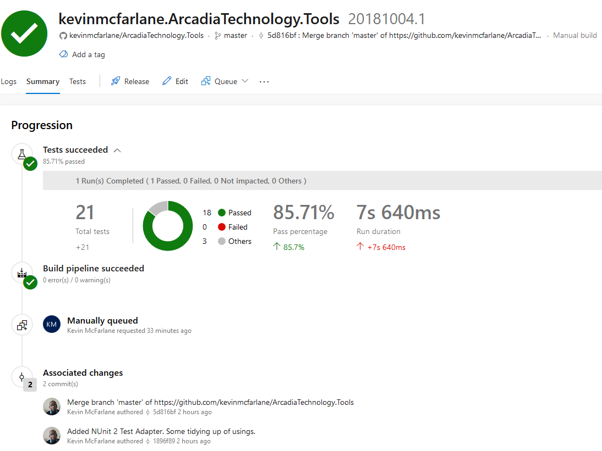

# .NET Utilities

A toolbox of .NET utilities for various tasks. 

The SpecFlow version used is 1.8. Version 2.0 was released in January 2016.

### Tech

* [NUnit] - NUnit is a unit-testing framework for all .Net languages.
* [SpecFlow] - Acceptance Test Driven Development (ATDD) and Behaviour Driven Development (BDD) framework.

[SpecFlow]: <http://www.specflow.org/>
[NUnit]: <http://www.nunit.org/>
